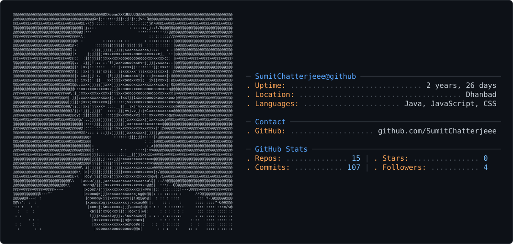

## 👋 Glad to See You Here!

<table>
<tr>
<td width="50%" align="center" valign="middle">

Glad To See you here, Iam a software enginner/developer trying to build simple applications for the world while maintaining the robustness and scalibilty  

<picture>
  <source media="(prefers-color-scheme: dark)" srcset="cropped-dark_mode.svg" />
  <source media="(prefers-color-scheme: light)" srcset="light_mode.svg" />
  
</picture>

</td>

<td width="50%" valign="middle">

<pre>
&lt;skills&gt;

  &lt;languages&gt;
    Java · Python · JavaScript · SQL
  &lt;/languages&gt;

  &lt;backend&gt;
    Spring Boot · Spring Security
    Spring Data JPA · Hibernate
    REST APIs · Microservices
  &lt;/backend&gt;

  &lt;frontend&gt;
    React · HTML · CSS · Tailwind CSS
  &lt;/frontend&gt;

  &lt;databases&gt;
    PostgreSQL · MySQL · Redis
    Elasticsearch · Vector Databases
  &lt;/databases&gt;

  &lt;devops&gt;
    Docker · Kubernetes · AWS
    Kafka · Git · GitHub
  &lt;/devops&gt;

  &lt;ai&gt;
    Spring AI · LLM Integration
    RAG · Prompt Engineering
  &lt;/ai&gt;

&lt;/skills&gt;
</pre>

</td>
</tr>
</table>
